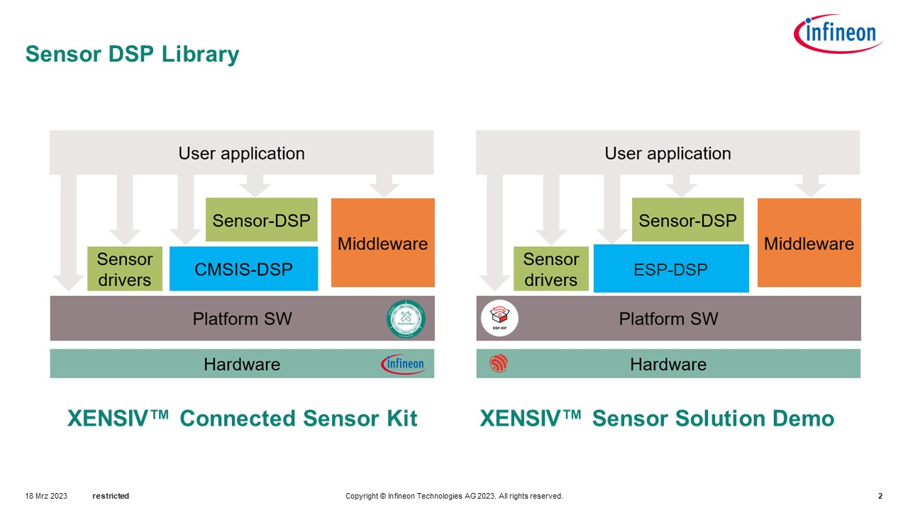

# Sensor-DSP Library

## Overview

The Sensor-DSP library provides signal processing functions required to support the implementation of different sensor applications, i.e. radar gesture recognition, vital sensing and presence detection. 

This library is ported from official [ModusToolbox™](https://www.infineon.com/cms/en/design-support/tools/sdk/modustoolbox-software/) released package on [Github/Infineon](https://github.com/Infineon/sensor-dsp). It builds on top of the standard [ESP DSP](https://github.com/espressif/esp-dsp) library instead of ARM CMSIS DSP. The API interface is maintained and for API Reference, please refer to the original [README.md](https://github.com/Infineon/sensor-dsp/blob/master/README.md)


   **Figure 1. Application architecture based on Sensor-DSP library and sensor drivers**

   

The sensor-dsp library provides the following features 

* Range and Doppler FFT
* FFT windowing related functions
* Detection related functions
* Angle estimation related functions
* Support functions

## Versioning 
This library adopts the following versioning convention:  `a.b.c+esp32-#`, where 
- `a.b.c` refers to the upstream official version it's ported from 
- `esp32` refers to the MCU platform 
- `#` refers to the build ID 


## How-to
This library is designed to be an ESP-IDF extra component. 

To include the component in the project, add the following line to the root `CMakeLists.txt` 

```
set(EXTRA_COMPONENT_DIRS path/to/extra/components/dir)
```
Note that this library is released in **binary** form. For any customization, please reach out to Infineon. 

### Tested Environment
Tested in `esp-idf-v5.0.1` with VSCode on Windows using [ESP-IDF extension](https://marketplace.visualstudio.com/items?itemName=espressif.esp-idf-extension) by adding library as an extra component for now. 

### Tested Devices 
Tested with XENSIV PAS CO2 Wing on the following devices:
* Adafruit ESP32 Feather V2 (Product ID [5400](https://www.adafruit.com/product/5400))
* Adafruit ESP32-S3 TFT Feather (Product ID [5483](https://www.adafruit.com/product/5483))
